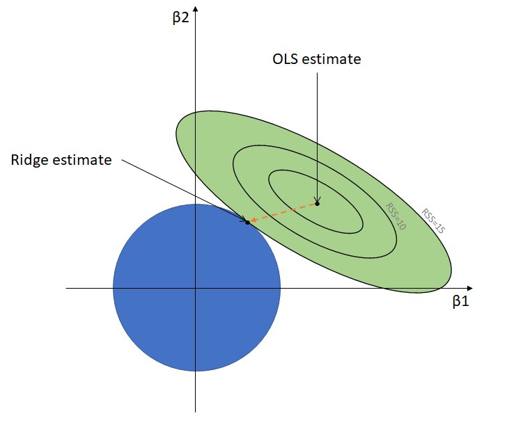

---

# 📘 **Ridge Regression with Cross-Validated Pipeline (RidgeCV)**

A complete end-to-end machine learning project demonstrating **Ridge Regression**, **Regularization**, **Pipeline Modeling**, **Cross-Validation**, and **Hyperparameter Tuning** using `RidgeCV` in Scikit-Learn.

---

## 🏆 **Project Overview**

This project implements a **Ridge Regression** model wrapped inside a **Scikit-Learn Pipeline**, combined with **10-fold Cross-Validation** to automatically select the **best value of the regularization parameter (alpha / λ)**.

The goal of the project is to provide:

* 🔍 A clean understanding of **why regularization is needed**
* 🏗 A well-structured ML pipeline (Preprocessing + Model)
* 🧪 Automatic hyperparameter tuning using **RidgeCV**
* 📉 Evaluation using **MSE, R²**, and visualization
* 📊 Business-level insights and discussion

This repository is ideal for:

* Students
* ML beginners
* Data science interview preparation
* Portfolio projects

---

## 📂 **Repository Structure**

```
│── 📁 Project Report & PPT
│     ├── PROJECT_Ridge_Regression PPT.pdf
│     ├── Project Report_ Predicting Housing Prices using Ridge Regression.pdf
│     ├── ridge.pdf
│── 📁 Ridge_Pic
│     ├── Ridge_Info.png
│     ├── Ridge_point.webp
│     ├── reg_intro.webp
│── HousingData.csv
│── ridge-regression-on-boston-housing-an-end-to-end.ipynb
│── README.md 

```

---

# 🧠 **1. Introduction to Regression & Regularization**

### 📌 What is Regression?

Regression is a supervised learning technique used to predict continuous outcomes.
It tries to find the best-fit linear relationship between **features (X)** and **target (y)**.

### 📌 Why Regularization?

Real-world data often contains:

* High correlation between features
* Noise
* Multicollinearity
* High variance

➡ This leads to **overfitting**, where the model performs well on training data but poorly on test data.

### 🩹 Regularization fixes this.

Regularization introduces a **penalty term** to control model complexity.

---

# 🖼 **Regression Overview**


---

# 🧩 **2. Understanding Ridge Regression (L2 Regularization)**

Ridge Regression adds an **L2 penalty** to shrink coefficients:

[
\text{Loss} = \sum (y - \hat{y})^{2} + \lambda \sum \beta^{2}
]

Where:

* **λ (alpha)** controls the amount of shrinkage:

  * λ = 0 → same as Linear Regression
  * High λ → coefficients shrink more, reducing overfitting

---

# 🖼 Ridge Regression Concept


---

# 🎯 **3. RidgeCV: Automatically Finding the Best λ (alpha)**

Instead of manually selecting alpha, we use:

```python
RidgeCV(alphas=alphas, scoring='neg_mean_squared_error', cv=10)
```

This performs:

* 10-fold cross-validation
* Testing multiple α values
* Selecting α that minimizes MSE

---

# 🛠 **4. End-to-End Pipeline Implementation**

### ✔ Why Pipeline?

A pipeline ensures:

* No data leakage
* Consistent preprocessing
* Clean model structure

---

## 🧪 **Code Used in This Project**

### ✔ Ridge Regression Pipeline with Cross-Validation

```python
ridge_pipeline = Pipeline([
    ('preproc', preprocessor),
    ('model', RidgeCV(alphas=alphas, scoring='neg_mean_squared_error', cv=10))
])

ridge_pipeline.fit(X_train, y_train)

best_alpha = ridge_pipeline.named_steps['model'].alpha_
print("Best alpha:", best_alpha)
```

### ✔ What this does:

* Applies preprocessing
* Trains Ridge model on multiple α
* Performs 10-fold CV
* Returns the **optimal α**

---

# 🖼 Ridge Regression Key Points



---

# 📊 **5. Model Evaluation & Performance**

After fitting:

* Extract best alpha
* Predict on train & test
* Evaluate using:

  * Mean Squared Error (MSE)
  * Root MSE (RMSE)
  * R² Score

### Example:

```python
y_pred = ridge_pipeline.predict(X_test)

from sklearn.metrics import mean_squared_error, r2_score

print("MSE:", mean_squared_error(y_test, y_pred))
print("R2 Score:", r2_score(y_test, y_pred))
```

---

# 📈 **6. Insights & Interpretation**

### ✔ Best alpha chosen by RidgeCV

Helps prevent overfitting while maintaining good accuracy.

### ✔ Coefficient shrinkage

Ridge shrinks coefficients smoothly → more stable predictions.

### ✔ Pipeline benefits

Avoids leakage, ensures reproducibility, simplifies deployment.

### ✔ Cross-validation advantage

Ensures model performs well on unseen data.

---

# 🧾 **7. Key Takeaways**

✔ Ridge Regression reduces overfitting through L2 penalty
✔ Cross-validation ensures robust hyperparameter selection
✔ Pipeline maintains clean workflow
✔ RidgeCV automatically finds the best λ
✔ Excellent for correlated datasets & high-dimensional data

---

# 🚀 **8. How to Run This Project**

### Install dependencies:

```bash
pip install -r requirements.txt
```

### Run the notebook:

```bash
jupyter notebook ridge_pipeline.ipynb
```

---

# 🤝 **9. Contributions**

Contributions are welcome!
Feel free to submit:

* Pull Requests
* Issues
* Improvements
* Visualizations

---

# ⭐ **10. Support**

If you like this project:

* ⭐ Star the repository
* 📢 Share it
* 🤝 Connect for collaboration

---


# 🌐 **11. My Kaggle Notebook**

You can view the full implementation on Kaggle:

<div align="left">

[](https://www.kaggle.com/code/sudiptbiswas1/ridge-regression-on-boston-housing-an-end-to-end/notebook)

</div>

---

# 🔗 **12. Connect With Me**

<div align="left">

[](https://www.linkedin.com/in/sudipta-biswas-298915271/)

</div>

---


